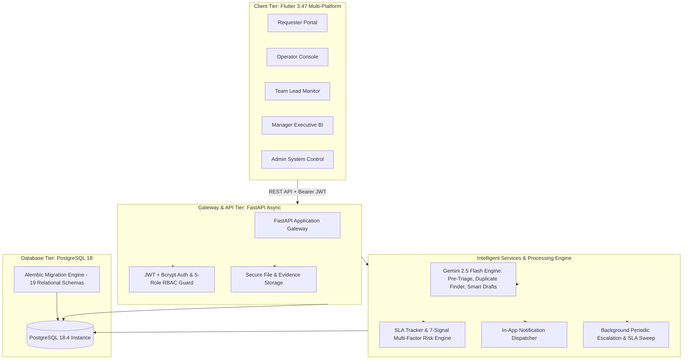

# 🚀 AI Office IT Help Desk

> **Enterprise-Grade Intelligent IT Service Management (ITSM) Platform**  
> Powered by **FastAPI (Async Python)**, **PostgreSQL 18**, **Google Gemini 2.5 Flash**, and **Flutter 3.47+ (Cross-Platform)**.

[-success?style=flat-square&logo=pytest)](file:///d:/ProjectFolder/AIHelpDesk/backend/tests)
[-success?style=flat-square&logo=flutter)](file:///d:/ProjectFolder/AIHelpDesk/frontend/test)
[](https://www.python.org/)
[](https://fastapi.tiangolo.com/)
[](https://www.postgresql.org/)
[](https://flutter.dev/)
[](https://ai.google.dev/)
[](https://www.docker.com/)

---

## 📌 Executive Summary & Architecture Overview

The **AI Office IT Help Desk** is a mission-critical support system tailored for modern enterprises. It manages the entire lifecycle of hardware, network, software, security, and infrastructure incidents with autonomous AI pre-triage, dynamic SLA tracking, multi-factor risk scoring, and role-tailored real-time dashboards.

### 🚫 Strictly No-Email Architecture
In compliance with enterprise security requirements, this platform operates on a **zero-SMTP / zero-email footprint**. All external email dependencies are replaced by:
- In-app high-fidelity notification feeds with real-time unread badges.
- Threaded, tamper-evident case communication timelines with role-isolated internal notes.
- Modular async push notification adapters (ready for Slack, Microsoft Teams, and Webhooks).

---

## 🏗️ System Architecture



---

## ✨ Key Platform Capabilities

### 1. 🤖 Autonomous Gemini 2.5 Flash AI Engine
- **Instant Pre-Triage:** Automatically predicts Category, Urgency (`LOW`, `MEDIUM`, `HIGH`, `CRITICAL`), and Team routing.
- **Clarification Generator:** Identifies missing technical context and drafts immediate follow-up questions for the requester.
- **Duplicate & Correlation Search:** Semantic vector + keyword search identifying matching historical or ongoing incidents.
- **Operator Draft Assistant:** Drafts high-accuracy, empathetic initial responses and resolution proposals.
- **Human-in-the-Loop:** All AI recommendations can be accepted or overridden with full operator discretion.

### 2. 🛡️ Enterprise 5-Role RBAC Guard
- **`REQUESTER`:** Create cases, upload evidence files, track real-time SLA countdowns, converse with operators, and approve/reject resolution proposals.
- **`OPERATOR`:** Live queues (`Unassigned`, `My Active Cases`, `Pending Review`), AI inspection modal, internal notes, checklist execution, and resolution proposal submission.
- **`TEAM_LEAD`:** Real-time team workload matrix, operator case assignments, re-routing, and SLA breach monitors.
- **`MANAGER`:** Executive KPI dashboards (MTTA, MTTR, SLA compliance %, resolution rate %, category & team bottlenecks).
- **`ADMIN`:** Infrastructure health monitors, RBAC user directory, audit logs, AI acceptance rates, and system settings.

### 3. ⏱️ Dynamic SLA Engine & 7-Signal Multi-Factor Risk Engine
- Real-time SLA target countdowns calculated from business-hour policies (`Critical-1h`, `High-4h`, `Medium-8h`, `Low-24h`).
- 7-Signal Composite Risk Score ($0.0 - 1.0$) evaluating:
  1. *Elapsed SLA Time Ratio*
  2. *Case Urgency Weight*
  3. *Unread Message Count & Requester Inactivity*
  4. *Pending Internal Checklist Tasks*
  5. *Assigned Operator Workload Load*
  6. *Sentiment / Frustration Signals*
  7. *Historical Category Risk Profile*
- Automated state escalation when risk score exceeds configurable threshold ($\ge 0.75$).

### 4. 🎨 Modern Cyberpunk Dark Slate Flutter UI
- Built with **Flutter 3.47+** for Windows Desktop, Web (Chrome/Edge), macOS, Linux, and Mobile (Android/iOS).
- Custom design system: Deep obsidian slate (`#0B0F19`), Electric Indigo accents (`#6366F1`), and Emerald Teal highlights (`#10B981`).
- Glassmorphic card surfaces, responsive typography with Google Fonts (`Inter` & `JetBrains Mono`).
- **1-Click Persona Switcher:** Switch between all 5 role personas directly from the top navigation bar during demos and evaluations.

---

## 👥 Demo User Personas & Credentials

The database is pre-seeded with full operational test accounts:

| Persona | Role | Email | Password | Primary Interface Focus |
|---|---|---|---|---|
| **Alex Rivera** | `REQUESTER` | `requester@company.local` | `RequesterPass123!` | Case Creation, AI Chat, Resolution Confirmation |
| **Sam Operator** | `OPERATOR` | `operator@company.local` | `OperatorPass123!` | Live Queue, AI Pre-Triage Inspector, Checklist Tasks |
| **Morgan Lead** | `TEAM_LEAD` | `teamlead@company.local` | `LeadPass123!` | Operator Load Balancing, Team SLA Oversight |
| **Taylor Manager** | `MANAGER` | `manager@company.local` | `ManagerPass123!` | Executive Metrics, Team Throughput, Category Trends |
| **Jordan Admin** | `ADMIN` | `admin@company.local` | `AdminPass123!` | System Health, User RBAC Matrix, AI Telemetry |

---

## 🚀 Quickstart Guide

### Option A: Docker Compose (Recommended for Production / Evaluation)

Ensure [Docker Desktop](https://www.docker.com/) is installed and running.

```bash
# 1. Clone the repository
git clone https://github.com/sojalrajurkar-blip/AI-Office-IT-Help-Desk.git
cd AI-Office-IT-Help-Desk

# 2. Configure environment (Optional: add your Gemini API Key)
cp backend/.env.example backend/.env

# 3. Launch Backend & PostgreSQL container stack
docker-compose up --build
```
- FastAPI Backend & Swagger API Docs: `http://localhost:8000/docs`
- Health Check: `http://localhost:8000/health`

---

### Option B: Local Developer Environment Setup

#### 1. Backend Setup (FastAPI & PostgreSQL 18)

```powershell
# Navigate to backend directory
cd backend

# Create and activate virtual environment
python -m venv .venv
.\.venv\Scripts\Activate.ps1   # On Linux/macOS: source .venv/bin/activate

# Install dependencies
pip install -r requirements.txt

# Configure environment variables
cp .env.example .env
# Edit .env with your PostgreSQL credentials & GEMINI_API_KEY (optional)

# Run database migrations and seed baseline data
alembic upgrade head
python scripts/seed_data.py

# Start FastAPI development server
uvicorn app.main:app --reload --host 0.0.0.0 --port 8000
```

#### 2. Frontend Setup (Flutter Multi-Platform)

```powershell
# Navigate to frontend directory
cd frontend

# Get Flutter packages
flutter pub get

# Run on Windows Desktop
flutter run -d windows

# Or run on Chrome Web Browser
flutter run -d chrome
```

---

## 🧪 Testing & Quality Assurance

### 1. Backend Test Suite (Pytest)
Comprehensive suite covering authentication, RBAC authorization, case state machines, file uploads, Gemini AI mocks/fallbacks, SLA risk engines, and role dashboard aggregations.

```powershell
cd backend
.\.venv\Scripts\python -m pytest
```
*Result: **44/44 Tests Passing (100%)***

### 2. Full-Lifecycle E2E CLI Simulation
Simulates the entire multi-role ticket journey from creation to resolution and closure.

```powershell
cd backend
.\.venv\Scripts\python scripts/demo_e2e_scenario.py
```

### 3. Frontend Flutter Verification
```powershell
cd frontend
flutter test
flutter analyze
```
*Result: **13/13 Tests Passing (100%), 0 Analysis Errors or Warnings***

---

## 📚 API Reference Catalog

| HTTP Method | Endpoint | Description | Role Authorization |
|---|---|---|---|
| `POST` | `/api/v1/auth/login` | Authenticate & acquire JWT Bearer token | Public |
| `POST` | `/api/v1/auth/register` | Register new user account | Public |
| `GET` | `/api/v1/auth/me` | Fetch authenticated user profile & permissions | Any Authenticated |
| `GET` | `/api/v1/cases` | List filtered cases with pagination | Role-filtered |
| `POST` | `/api/v1/cases` | Create new incident (`IT-10001`+ atomic sequence) | Any Authenticated |
| `GET` | `/api/v1/cases/{id}` | Fetch full case details, timeline & checklist | Role-filtered |
| `PATCH` | `/api/v1/cases/{id}` | Update case status, team assignment, priority | Staff Only |
| `POST` | `/api/v1/cases/{id}/propose-resolution` | Propose formal resolution | Operator / Lead |
| `POST` | `/api/v1/cases/{id}/confirm-resolution` | Accept resolution & close case | Requester Only |
| `POST` | `/api/v1/cases/{id}/reject-resolution` | Reject resolution & reopen case | Requester Only |
| `POST` | `/api/v1/ai/triage` | Execute Gemini 2.5 Flash real-time triage | Any Authenticated |
| `POST` | `/api/v1/ai/duplicate-check` | Search for duplicate/correlated incidents | Any Authenticated |
| `POST` | `/api/v1/ai/draft-response` | Generate AI smart response draft | Staff Only |
| `GET` | `/api/v1/dashboards/me` | Dynamic role dashboard router | Any Authenticated |
| `GET` | `/api/v1/dashboards/requester` | Requester personal metrics | Requester |
| `GET` | `/api/v1/dashboards/operator` | Operator queue metrics | Operator |
| `GET` | `/api/v1/dashboards/team-lead` | Team workload & SLA matrices | Team Lead |
| `GET` | `/api/v1/dashboards/manager` | Executive MTTR/MTTA KPI analytics | Manager |
| `GET` | `/api/v1/dashboards/admin` | System health & RBAC directory metrics | Admin |
| `GET` | `/api/v1/notifications` | In-app notification feed | Any Authenticated |
| `POST` | `/api/v1/notifications/read-all` | Mark all notifications as read | Any Authenticated |
| `GET` | `/health` | Kubernetes / Docker liveness & readiness check | Public |

---

## 🗂️ Project Directory Structure

```text
AIHelpDesk/
├── backend/
│   ├── app/
│   │   ├── api/v1/          # Modular API Routers (Auth, Cases, AI, SLA, Dashboards, etc.)
│   │   ├── core/            # Configuration, Security, JWT, DB Session, Redis
│   │   ├── models/          # 19 SQLAlchemy 2.0 Relational Entity Models
│   │   ├── schemas/         # Pydantic v2 Request/Response Validation Schemas
│   │   └── services/        # Gemini AI, SLA Engine, Risk Evaluator, Notifications
│   ├── migrations/          # Alembic Migration Versions & Environment
│   ├── scripts/             # Seed Data, E2E Demo CLI, DB Initialization
│   ├── tests/               # 44 Comprehensive Async Pytest Test Modules
│   ├── Dockerfile           # Multi-Stage Production Container Specification
│   └── requirements.txt     # Locked Python Dependencies
├── frontend/
│   ├── lib/
│   │   ├── core/            # Theme, Color Tokens, Constants, HTTP API Client
│   │   ├── models/          # Dart Data Models (User, Case, Task, Metrics, etc.)
│   │   ├── providers/       # State Management Providers (Auth, Case, Notif, Dashboard)
│   │   ├── screens/         # Role-Tailored Screens (Requester, Operator, Lead, Mgr, Admin)
│   │   └── widgets/         # Reusable Custom Components (Header, Badges, Stat Cards)
│   └── test/                # Flutter Widget & State Tests
├── Docs/                    # Product Requirements (PRD), SRS, & Agent Architecture Specs
├── docker-compose.yml       # Production Container Orchestration
├── progress.md              # 14-Phase Implementation Progress Tracker
└── README.md                # System Architecture & Documentation
```

---

## 🔒 Security & Data Integrity

1. **Password Hashing:** Passwords hashed with `bcrypt` (work factor 12).
2. **Access Control:** Centralized `RBACGuard` dependency enforcing minimum role requirements across all endpoints.
3. **Data Isolation:** Requester accounts can only view their own cases and communications; internal staff notes (`is_internal=True`) are strictly stripped from requester payloads.
4. **File Evidence Security:** Content-type validation, size limits (max 25MB), sanitization of filenames, and local storage segregation with path traversal defenses.
5. **Rate Limiting & CORS:** Configurable CORS middleware with strict origin policies for enterprise deployments.

---

## 📄 License & Attribution
Designed and built for modern enterprise IT operations by the Google DeepMind Antigravity Advanced Agentic Coding Pair.
